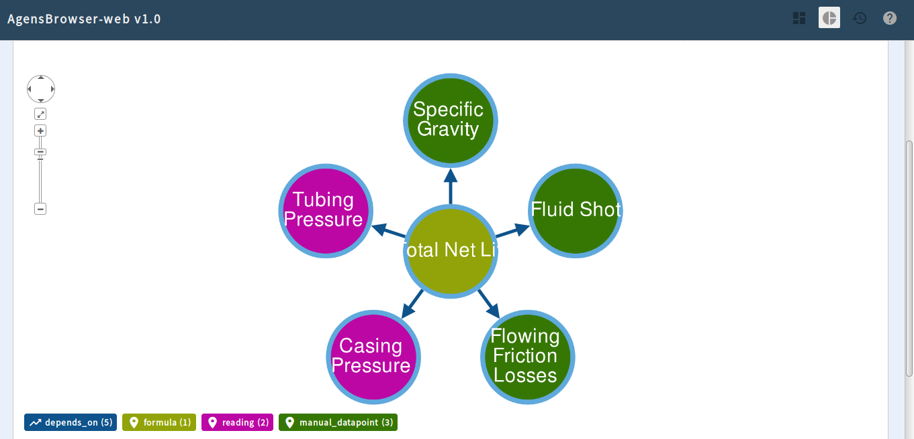
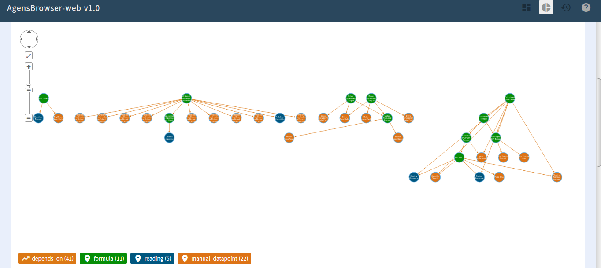
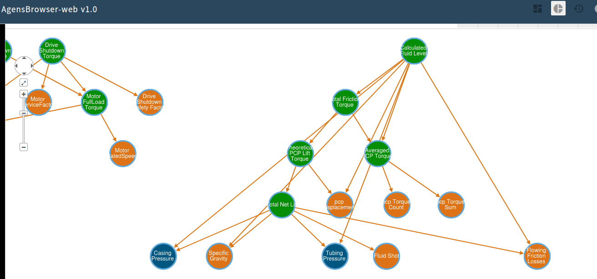

# frac: Formula and Rules engine w/Actions, contained.

### Development with SpringBoot Reactor & AgensGraph

#### A view of the console when a Scheduled Formula is calculated and its sole dependency has been updated from its default value i.e. null:

### Development with AgensGraph docker image(s)
The bitnine/**agensBrowser** docker image comes with *AgensGraph DB* included but **the webserver doesn't start automagically**.
So:
* create a couple of docker volumes (so that the DB & webserver configuration persist across restarts):
  * eg agensGraphVolume:
    * docker volume create agensGraphVolume
    * docker volume create agensBrowserVolume
* create the container w/the volumes. ports & shell, starting it as a daemon: 
  * sudo docker run -itd -v agensGraphVolume:/home/agens/AgensGraph/data -v agensBrowserVolume:/home/agens/AgensBrowser -p 80:8085 -p 5432:5432 --name agensBrowser bitnine/agensBrowser /bin/bash
* shell into the container:
  * sudo docker exec -it agensBrowser /bin/bash
  * create the graph database and the graph *in* the database (once is enough 8^):
    * from the shell: 
      * createdb frac
      * agens frac
        * from the PostgreSQLAgensGraph CLI i.e. *agens*:
          * CREATE GRAPH frac;
          * ALTER USER agens SET GRAPH_PATH = frac;
          * \dG
          * \q
* cd into the home of the webserver, configure it & start it (i.e. an executable JAR) up: 
  * cd /home/agens/AgensBrowser
  * vi agens-browser.config.yml:
    * in the agens:outer:datasource section:
      * change the trailing path segment of url from: agens to: frac
      * change graph_path to: frac
  * ./agensbrowser.sh

On the machine hosting the docker container: browse to http://localhost

* you can stop/start/shell into the container as needed e.g 
  * *sudo docker stop agensBrowser*
  * *sudo docker start agensBrowser*
  * *sudo docker exec -it agensBrowser /bin/bash*

#### AgensBrowser views:

##### A Formula:

##### Lots of Formulas:

##### A closer look at some Formulas

####### Open questions:

* the trailing part of the JDBC URL used by AgensBrowser webserver's config specifies the DB to connect to e.g. 'frac'
  * the webserver config specifies 'agens' as the user to login to the DB as.
  * issuing the ALTER USER agens SET graph_path = frac supposedly sets the graph path for the user, forever.
  * however, by default the JDBC URL's trailing part is set to 'agens'
    * Cipher statements issued thru such a webserver act on the 'agens_graph' graph
      * what is the relationship between graph_path and a named DB?
      * can a DB have **multiple** graphs?
